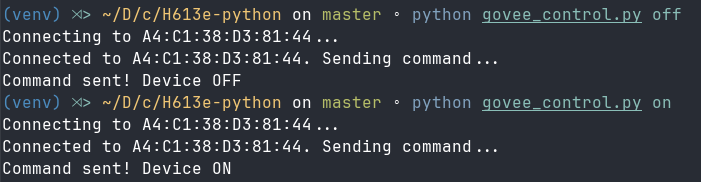

# Govee H613E

This script uses the already reverse engineered Govee H613E bluetooth commands to turn the light on and off.



## Usage

Set Govee BLE MAC address in the script.

```python
GOVEE_ADDRESS = "A4:C1:38:xx:xx:xx"
```

To see the available commands, run:

```bash
python govee_control.py
```

To turn the light on, run:

```bash
python govee_control.py on
```

To turn the light off, run:

```bash
python govee_control.py off
```

To scan for devices, run:

```bash
python govee_control.py scan
```
